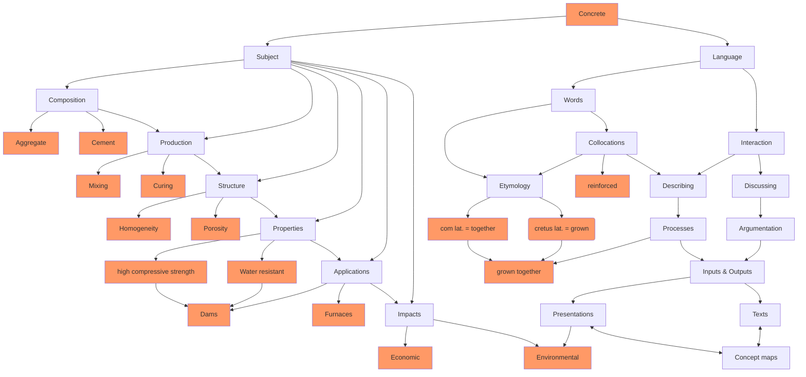
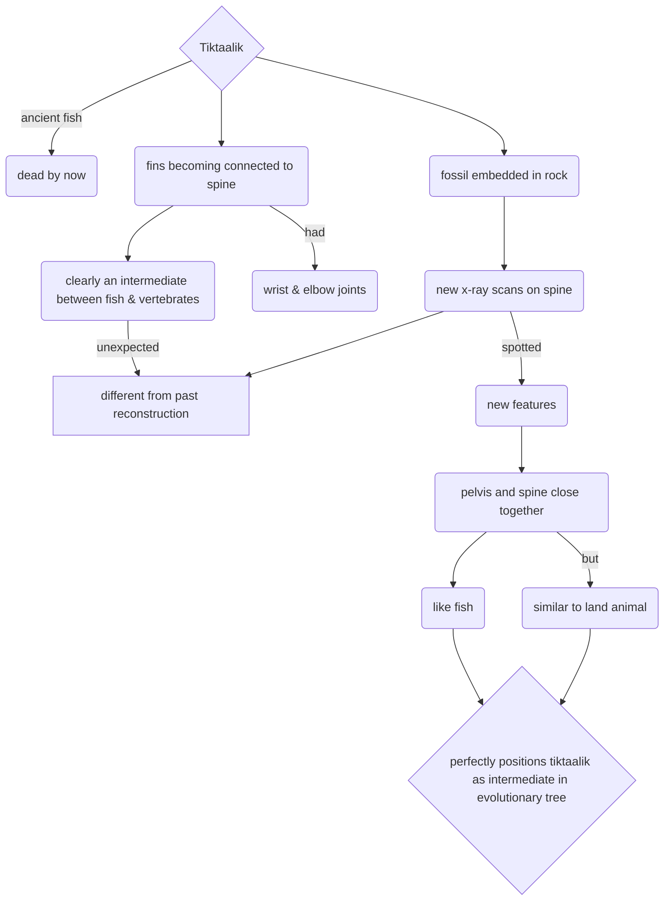
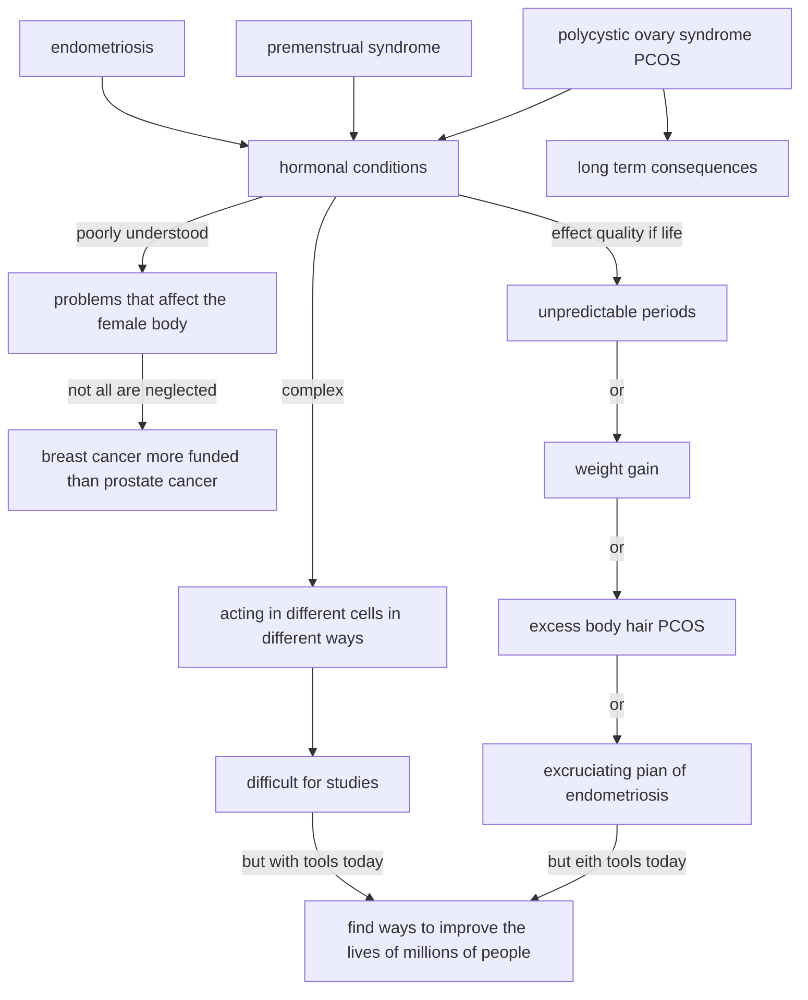
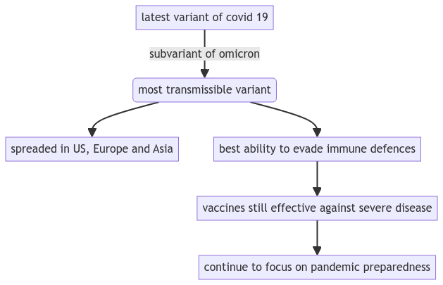
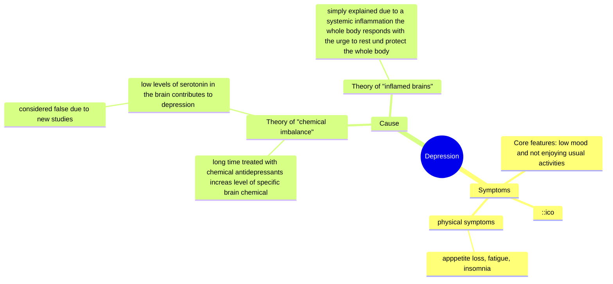
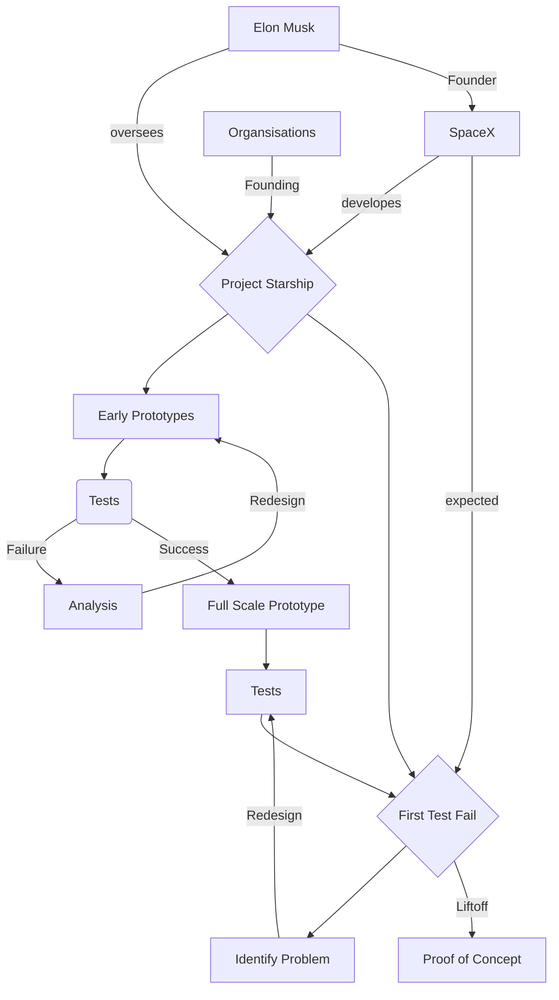
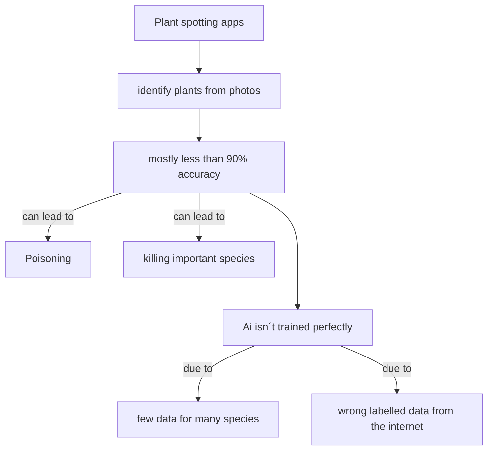
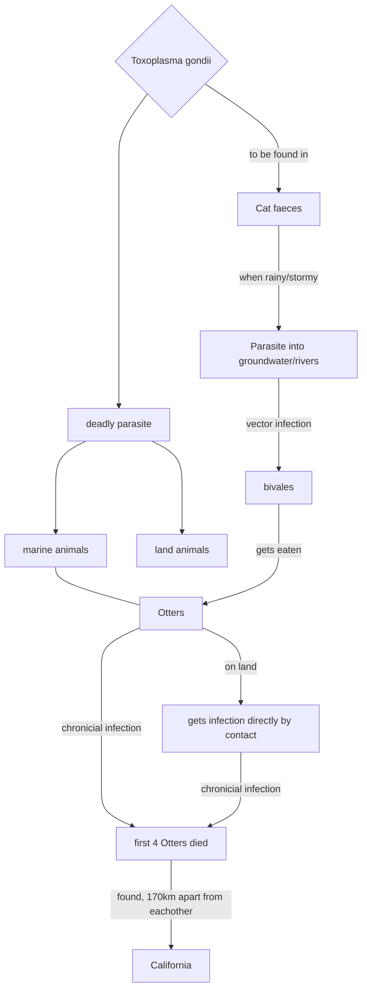

<!--
author:   Dr. Mark Jacob
email: mark.jacob@iuz.tu-freiberg.de
version:  0.0.1
language: en
narrator: UK English Female
comment: Content of week 3 WS 2023/2024
icon: https://upload.wikimedia.org/wikipedia/commons/thumb/e/e8/TUBAF_Logo.svg/800px-TUBAF_Logo.svg.png
script:   https://cdn.jsdelivr.net/npm/mermaid@10.5.0/dist/mermaid.min.js
import: https://raw.githubusercontent.com/liaScript/mermaid_template/master/README.md
-->

[](https://liascript.github.io/course/?https://github.com/TUBAF-IUZ-LiaScript/EF_Chemistry_23/blob/main/Chemistry_concept_maps.md)

# Concept maps

## sample map



## Concept map AJ



## Concept map JH



## Concept map MKl

```mermaid @mermaid

```

## Concept map MZ

```mermaid @mermaid
flowchart TD
    A{Soil bacteria
     enzyme generates 
    electrcity from hydrogen
     in the air} -->|make energy| B(could power fuel cells or generators)
     A -->|called| C[Huc]
    A --> D[consume hydrogen to make their energy take in about
     60 million tonnes of gas globally each year]

    C -->|Melbourne university| E[iron and nickel based enzyme]
    E --> H[unclear how it works]
    H--> |scientific analysis| F
    H --> |scientific analysis|G[resistant to gases like oxigen and carbon monoxide]
    C -->|able to| F[break down hydrogen into electrons]
    H--> |scientific analysis| I[works in temperatures from freezing to 80°C]
    H --> |scientific analysis|J[consruction of electrical curcuits]
    J--> B 
```

## Concept map SJ

```mermaid @mermaid

```

## Concept map LF



## Concept map JK

```mermaid @mermaid
flowchart TD
A[mystery about photosynthesis] --> B(4 particles of light) 
    B --> C[hit protein complex - PSII]-->D[H2O -> O2] --> E{What happens after 4th photon
    hits PSII?}-->|x-rays|F[delay between splitting H2O and formation of O2]-->G[oxygen forms new structure]--> H[O bound to another part of PSII]-->|computer simulations|I[new step: O and PSII exchange three protons for one electron]
```

## Concept map LL



## Concept map NW



## Concept map SR

```mermaid @mermaid

```

## Concept map CK

```mermaid @mermaid
flowchart TD
    A[gender equality in science ] -->|90% by men | B(publishing papers )
    B -->|percentage of articles from woman increasing | C(years that this field reach gender parity )
    C -->|biology| D[2069]
    C -->|chemistry| E[2087]
    C -->|physics | F[2158]
    C --> |engineering| G[2144]
    C --> |other fields | H[2146-2158]
    B --> I(solutions for equality )
    I --> J[change in recruiting and promoting ] 
    B --> K(benefits of equality )
    K--> |more presentable |L[changes in research ]
```

## Concept map HB



## Concept map FB



## Concept map SG

```mermaid @mermaid

```

## Concept map MKa

```mermaid @mermaid

```